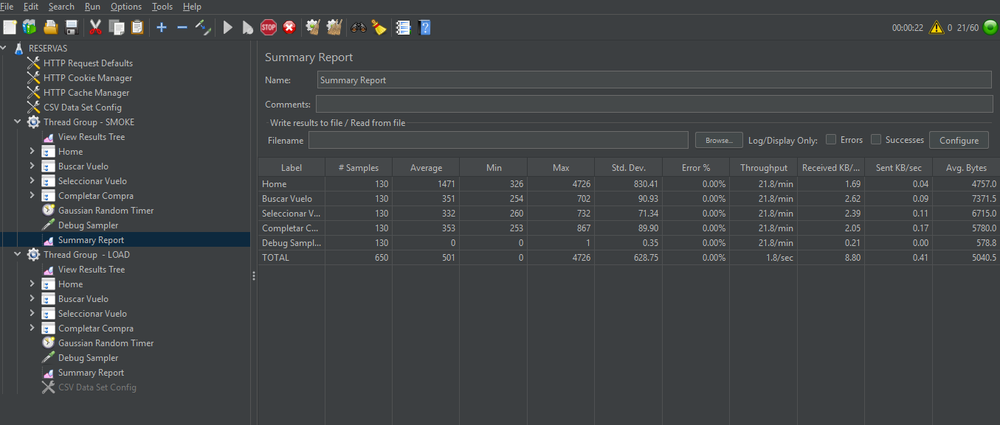
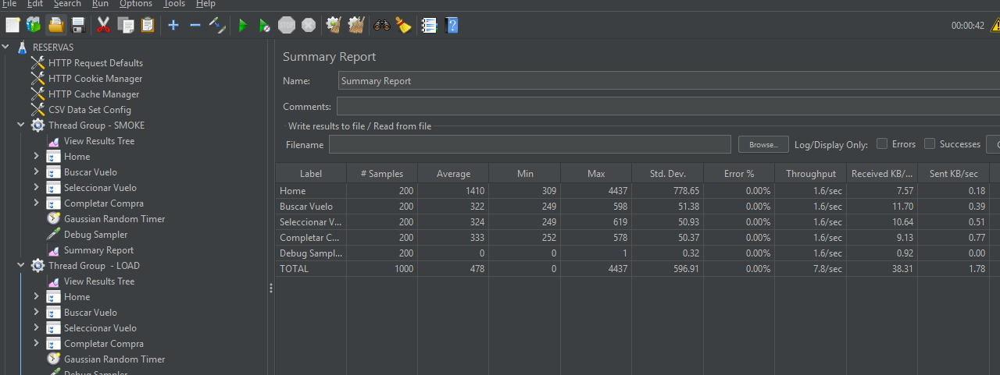
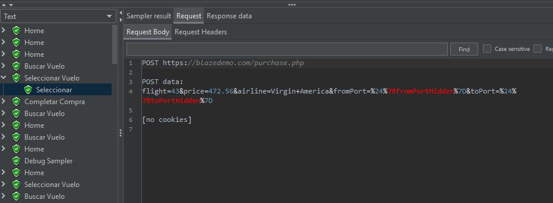

# BlazeDemo
MODULO 7 ACTIVIDAD 3 
GRUPO 3 

Ejecución GUI/CLI Smoke

Ejecución GUI/CLI Load

Request Body de purchase.php 

*Conclusiones:
1. El paso más lento es la página Home, ya que tiene un tiempo promedio de respuesta de 1437 lisegundos.
2. Este además tiene una desviación estándar de 389 milisegundos y un máximo de más de 2 segundos, lo que indica una mayor variabilidad.
3. Esto indica que la carga inicial de la página es el cuello de botella principal.

